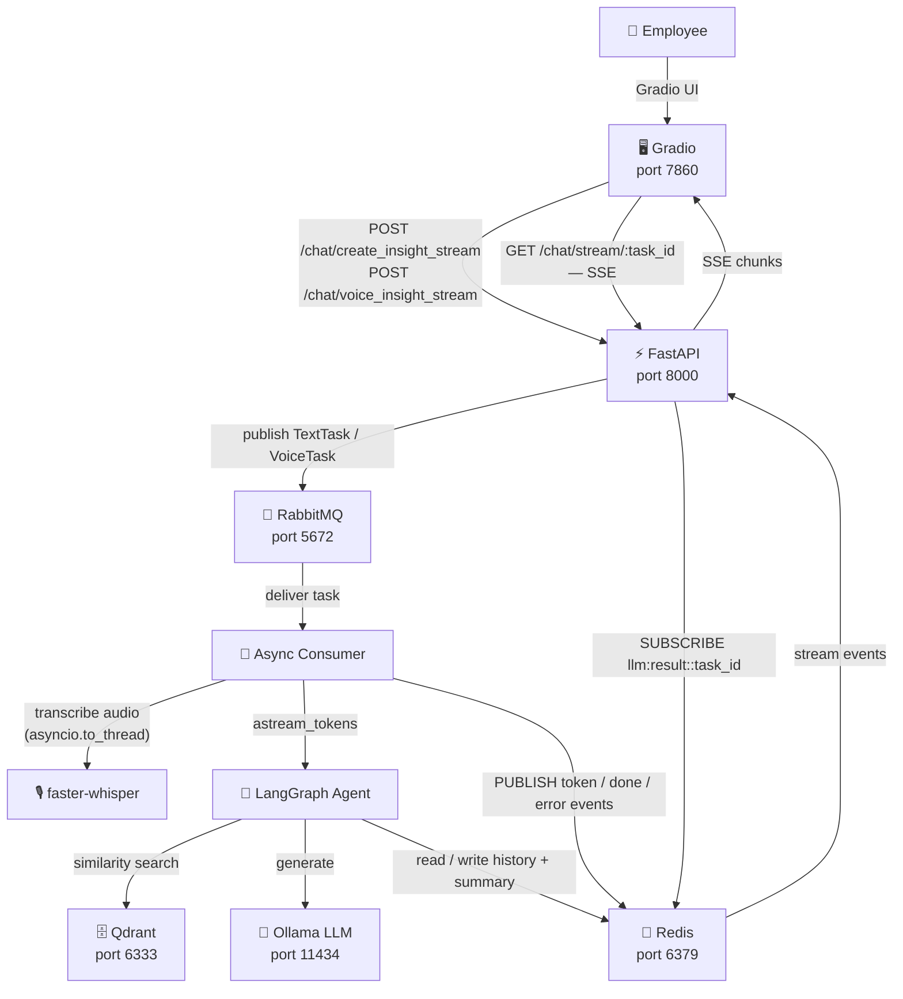
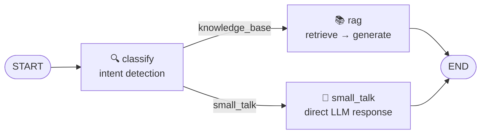
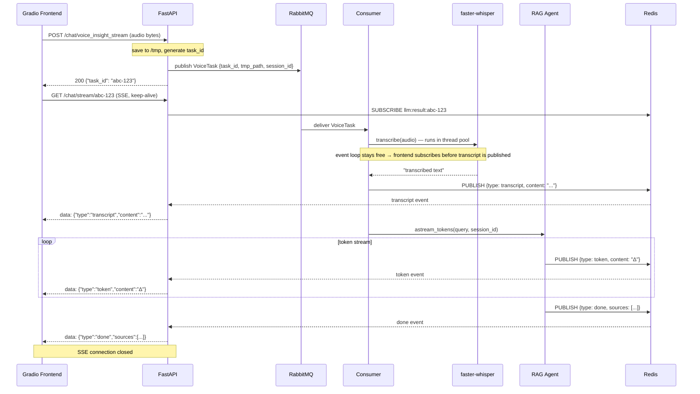
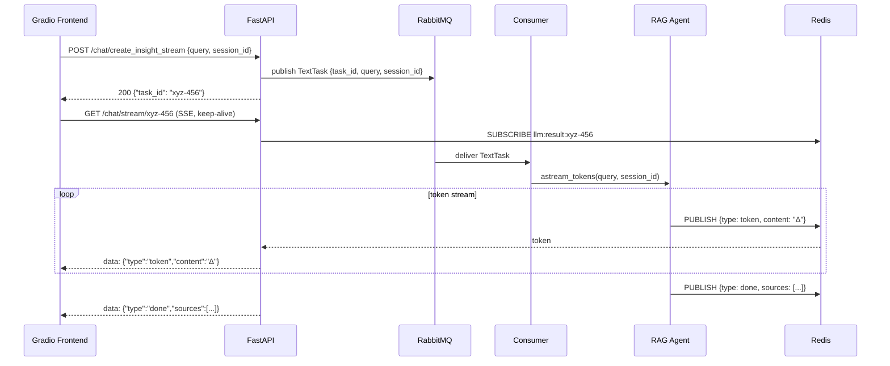

# 🛟 FinBridge RAG Assistant

> An intelligent employee onboarding assistant powered by a **LangGraph RAG agent**, async task processing via **RabbitMQ**, real-time token streaming over **Redis Pub/Sub**, and a voice-enabled **Gradio** interface.

---

## Table of Contents

- [Overview](#overview)
- [Tech Stack](#tech-stack)
- [Architecture](#architecture)
  - [High-Level Architecture](#high-level-architecture)
  - [LangGraph Agent Graph](#langgraph-agent-graph)
  - [Voice Message Flow](#voice-message-flow)
  - [Text Message Flow](#text-message-flow)
- [Module Overview](#module-overview)
- [Getting Started](#getting-started)
  - [Prerequisites](#prerequisites)
  - [Environment Variables](#environment-variables)
  - [Running Infrastructure](#running-infrastructure)
  - [Running the Application](#running-the-application)

---

## Overview

**FinBridge RAG Assistant** is a corporate knowledge-base chatbot that helps new employees get answers about company processes, policies, and tools — with support for both text and voice input.

Key capabilities:

- **RAG Pipeline** — retrieves relevant document chunks from Qdrant, feeds them to a local LLM via Ollama, and streams the answer token by token
- **Intent Classification** — the LangGraph agent routes queries between a knowledge-base RAG node and a small-talk node
- **Async Task Queue** — API endpoints publish tasks to RabbitMQ immediately and return a `task_id`; a background consumer handles heavy computation without blocking the HTTP layer
- **Real-Time Streaming** — tokens are pushed from the consumer to the frontend via Redis Pub/Sub and Server-Sent Events (SSE)
- **Voice Input** — audio is transcribed by faster-whisper (in a thread pool so the event loop stays free) and then processed by the same RAG pipeline
- **Conversation Memory** — per-session chat history and progressive summarization stored in Redis

---

## Tech Stack

| Category | Technology |
|---|---|
| **Language** | Python 3.13 |
| **API Framework** | FastAPI |
| **Frontend** | Gradio |
| **LLM Orchestration** | LangGraph, LangChain |
| **LLM Runtime** | Ollama (local, e.g. `deepseek-r1:1.5b`) |
| **Vector Database** | Qdrant |
| **Embeddings** | BAAI/bge-small-en (HuggingFace) |
| **Message Broker** | RabbitMQ (aio-pika) |
| **Cache / Pub-Sub** | Redis (redis-asyncio + langchain-community) |
| **Speech-to-Text** | faster-whisper |
| **HTTP Client** | httpx |
| **Settings** | pydantic-settings |
| **Containerization** | Docker + Docker Compose |

---

## Architecture

### High-Level Architecture



---

### LangGraph Agent Graph

The agent classifies every query first and then routes it to the appropriate node.



- **classify** — synchronous intent classification using the LLM
- **rag** — retrieves top-k chunks from Qdrant, builds a context-aware prompt, streams the answer
- **small_talk** — answers conversational queries directly without touching the vector store

---

### Voice Message Flow



---

### Text Message Flow



---

## Module Overview

```
finbridge/
├── main.py                         # FastAPI entry point; lifespan wires up broker + consumer
├── config.py                       # Pydantic settings (env-driven)
│
├── service/
│   ├── api/
│   │   ├── chat/                   # /chat — text, voice, SSE stream, session endpoints
│   │   ├── Documents/              # /admin/documents — upload, reindex, delete
│   │   └── core/                   # Shared response helpers
│   │
│   ├── bot/
│   │   ├── agent.py                # LangGraph RAGAgent (classify → rag / small_talk)
│   │   └── tools.py                # Intent classifier + Qdrant retriever
│   │
│   ├── broker/
│   │   ├── publisher.py            # RabbitMQPublisher — publishes TextTask / VoiceTask
│   │   ├── consumer.py             # RabbitMQConsumer — subscribes to queues, dispatches handlers
│   │   ├── handlers.py             # handle_text_task, handle_voice_task — core async workers
│   │   ├── result_store.py         # RedisResultStore — Pub/Sub publish + SSE event streaming
│   │   └── models.py               # TextTask, VoiceTask Pydantic models
│   │
│   ├── ShortTermMemory/
│   │   └── redis_storage.py        # RedisHistoryStore — per-session history + progressive summary
│   │
│   ├── RAG/
│   │   └── docs_service.py         # Document ingestion: parse → chunk → embed → upsert Qdrant
│   │
│   ├── vectorstore/
│   │   └── client.py               # Qdrant async client wrapper
│   │
│   └── whisper/
│       └── transcriber.py          # WhisperTranscriber — faster-whisper singleton
│
└── client/
    ├── frontend.py                 # Gradio app entry point
    └── tabs/
        ├── chat_tab.py             # Chat UI: text input, voice input, SSE consumer
        └── documents_tab.py        # Documents UI: upload, reindex, delete
```

---

## Getting Started

### Prerequisites

- Python 3.13+
- [Docker](https://www.docker.com/) + Docker Compose
- [Ollama](https://ollama.com/) installed and running

### Environment Variables

Copy the example and fill in your values:

```bash
cp .env.example .env
```

| Variable | Description | Example |
|---|---|---|
| `MODEL` | Ollama model name | `deepseek-r1:1.5b` |
| `BASE_URL` | Ollama base URL | `http://localhost:11434` |
| `AI_API_KEY` | LLM provider API key | `ollama` |
| `QDRANT_HOST` | Qdrant host | `http://localhost` |
| `QDRANT_PORT` | Qdrant port | `6333` |
| `QDRANT_COLLECTION_NAME` | Collection name | `finbridge_docs` |
| `REDIS_URL` | Redis connection URL | `redis://localhost:6379` |
| `REDIS_TTL` | History TTL in seconds | `3600` |
| `RABBITMQ_USER` | RabbitMQ username | `guest` |
| `RABBITMQ_PASS` | RabbitMQ password | `guest` |
| `RABBITMQ_HOST` | RabbitMQ host | `localhost` |
| `RABBITMQ_PORT` | AMQP port | `5672` |
| `EMBEDDINGS_MODEL_NAME` | HuggingFace embedding model | `BAAI/bge-small-en` |
| `WHISPER_MODEL` | Whisper model size (`tiny` / `base` / `small`) | `base` |
| `API_URL` | FastAPI base URL used by Gradio | `http://localhost:8000` |
| `GRADIO_PORT` | Gradio server port | `7860` |

---

### Running Infrastructure

Start all backing services with a single command:

```bash
docker compose up -d
```

| Service | URL |
|---|---|
| Qdrant Dashboard | http://localhost:6333/dashboard |
| Ollama API | http://localhost:11434 |
| RabbitMQ Management UI | http://localhost:15672 |
| Redis | `localhost:6379` |

Pull the LLM model into Ollama:

```bash
docker exec ollama ollama pull deepseek-r1:1.5b
```

---

### Running the Application

Install dependencies:

```bash
cd finbridge
pip install -r requirements.txt
```

Start the **FastAPI backend** — the RabbitMQ consumer starts automatically as a background task:

```bash
python main.py
```

In a separate terminal, start the **Gradio frontend**:

```bash
python client/frontend.py
```

| Interface | URL |
|---|---|
| Gradio UI | http://localhost:7860 |
| FastAPI Swagger | http://localhost:8000/docs |

---

*Author: [@Raisin228](https://github.com/Raisin228)*
